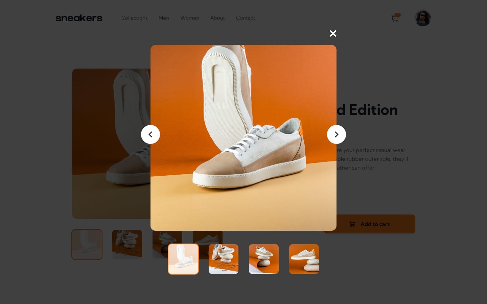
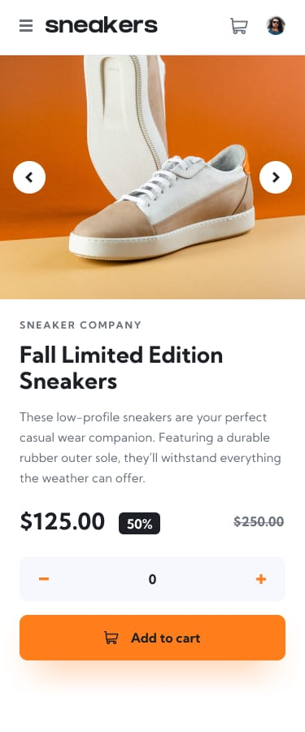

# E-commerce Product Page

This project is an e-commerce product page built with a mobile-first approach. It features a responsive design that adapts seamlessly to different screen sizes, ensuring an optimal user experience on both mobile and desktop devices.

## Screenshots

### Desktop View

### Desktop Lightbox

### Mobile View

### Mobile Menu

## Features

- **Responsive Design**: The layout adjusts to various screen sizes, providing a consistent experience across devices.
- **Product Gallery**: Users can view product images and navigate through them using thumbnails and navigation buttons.
- **Lightbox**: A lightbox feature allows users to view larger versions of the product images.
- **Cart Functionality**: Users can add items to the cart, view the cart contents, and remove items from the cart.
- **Quantity Management**: Users can increase or decrease the quantity of items before adding them to the cart.

## Components

- **Navbar**: Contains the navigation links and cart icon. The cart icon displays the number of items in the cart.
- **Gallery**: Displays the main product image and thumbnails. Users can navigate through images and open a lightbox for a larger view.
- **Description**: Provides details about the product, including the name, price, and a brief description.
- **BuyingSection**: Allows users to select the quantity of the product and add it to the cart.

## Technologies Used

- **React**: For building the user interface.
- **Tailwind CSS**: For styling the components.
- **TypeScript**: For type safety and better development experience.

## Folder Structure

- **src/components**: Contains all the React components used in the project.
- **src/components/types**: Contains TypeScript type definitions for the components.
- **public/images**: Contains the images used in the project.

## Mobile-First Approach

This project was developed with a mobile-first approach, ensuring that the design and functionality are optimized for mobile devices before scaling up to larger screens. This approach helps in creating a more accessible and user-friendly experience for mobile users.
